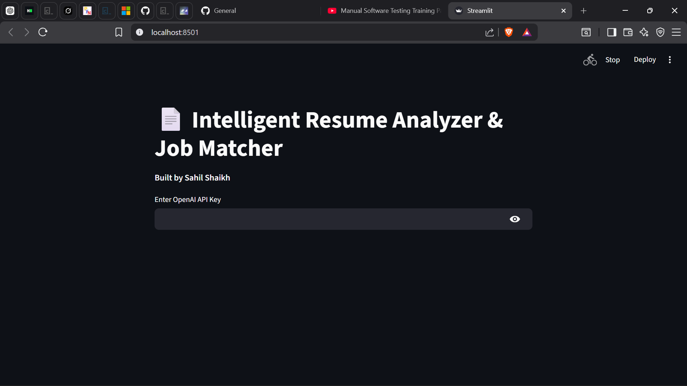

# 📄 Intelligent Resume Analyzer & Job Matcher

**Built by: Sahil Shaikh**

An AI-powered tool that analyzes resumes and suggests suitable job roles, skill improvements, and target companies using **OpenAI GPT**.

 <!-- Add screenshot later -->

## Features
- Paste resume text and get instant analysis
- Suggests relevant job roles with reasons
- Identifies missing skills and improvement areas
- Recommends target companies
- Clean and simple Streamlit interface

## Tech Stack
- Python
- OpenAI GPT-3.5-turbo
- Streamlit
- Prompt Engineering

## How to Use

1. Enter your OpenAI API Key
2. Paste your resume text
3. Click **"Analyze Resume & Suggest Jobs"**
4. Get detailed AI analysis instantly

## How to Run Locally

```bash
# Clone the repository
git clone https://github.com/Sahil-SCOE/resume-analyzer-ai.git
cd resume-analyzer-ai

# Install dependencies
pip install -r requirements.txt

# Run the application
streamlit run app.py