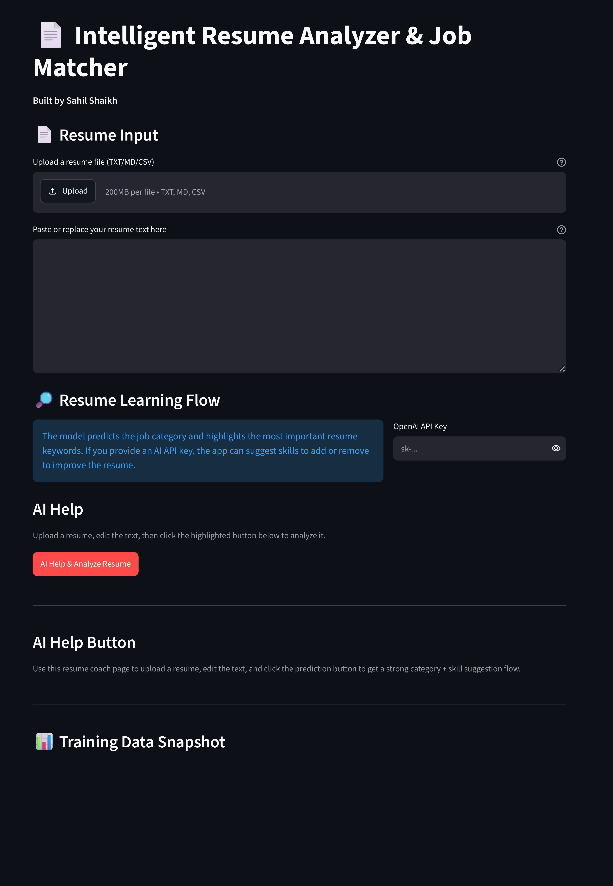
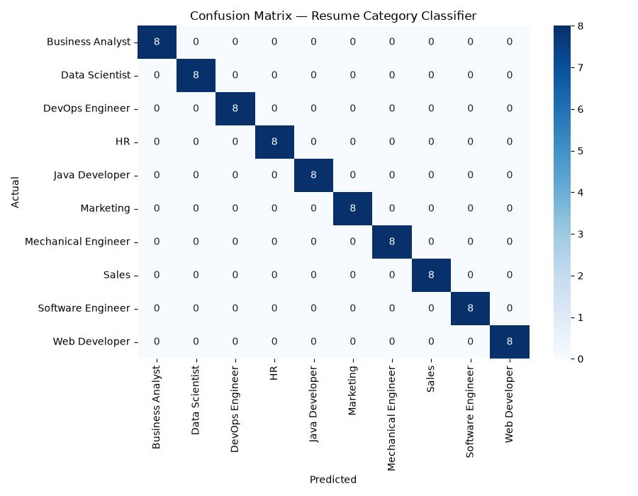

# 📄 Resume Insight Coach

This project is a beginner-friendly AI resume analysis system that combines:
- a local machine learning classifier for category prediction
- a Streamlit dashboard for dataset exploration
- optional OpenAI-powered resume coaching suggestions

It is designed to help you understand how resume text can be converted into structured insights using Python, machine learning, and dashboards.

## What this project does

- Predicts the likely job category of a resume
- Shows the top keywords contributing to that prediction
- Gives suggestions on skills to add or remove for better resume quality
- Visualizes the synthetic dataset in an interactive dashboard
- Helps users learn the full pipeline from data generation to model training to deployment

## How the workflow works

This project is designed as a two-step experience:

1. Open the dashboard on port 8502 to inspect the dataset insights, category balance, and key keywords.
2. Scroll down on the dashboard and click the bottom action called "AI Resume Help" to open the resume coach on port 8501.
3. On the resume coach page, upload your own resume file or paste the text into the text area.
4. Click the highlighted "AI Help & Analyze Resume" button.
5. The app predicts the likely job category, shows the confidence chart, highlights the top keywords, and recommends skills to add or remove.
6. If you provide an OpenAI API key, the app can also generate AI-powered improvement suggestions.

This gives you a clean flow of:
- first check the insights
- then use AI help to analyze your own resume

## Project Highlights

- Synthetic dataset with 400 resumes
- 10 balanced categories
- Beginner-friendly code structure
- Local model training workflow
- Optional GPT-based improvement suggestions

## Screenshots

### Dashboard overview


This output shows the distribution of resumes across the 10 categories. It helps you understand whether the dataset is balanced and whether the model is being trained on a fair representation of all job types.

### Model evaluation snapshot
 



This output shows how well the classifier is performing by comparing predicted labels with actual labels. A strong diagonal pattern means the model is correctly classifying most resumes.

## How the dashboard outputs work

- The category distribution chart tells you how many resumes belong to each job category.
- The confusion matrix tells you where the model is making correct predictions and where it is confused between similar categories.
- Together, these two visuals help you evaluate both the dataset quality and the model quality.

## Tech Stack

- Python
- pandas
- scikit-learn
- Streamlit
- Plotly
- OpenAI GPT-3.5-turbo

## Dataset Insights

The generated dataset contains:
- 400 synthetic resumes
- 10 evenly balanced categories
- 40 resumes per category

This makes it suitable for:
- text classification experiments
- category distribution analysis
- keyword frequency exploration
- interactive visualization workflows

See the deeper analysis note in [analysis/resume_data_insights.md](analysis/resume_data_insights.md).

## How to run locally

### 1. Create and activate a virtual environment

```bash
python -m venv venv
venv\Scripts\activate
```

### 2. Install dependencies

```bash
pip install -r requirements.txt
```

### 3. Generate the synthetic dataset

```bash
python generate_dataset.py
```

### 4. Train the ML model

```bash
python model/train_model.py
```

### 5. Run the dashboard first

```bash
streamlit run src/resume_dashboard.py --server.port 8502
```

Open the dashboard to inspect the dataset insights.

### 6. Run the main resume coach

In a second terminal:

```bash
streamlit run src/app.py --server.port 8501
```

Use the dashboard's bottom "AI Resume Help" button to jump from the insights page to the resume coach page.

## Project Structure

- [generate_dataset.py](generate_dataset.py) — creates the synthetic resume dataset
- [data/resume_dataset.csv](data/resume_dataset.csv) — generated dataset
- [model/train_model.py](model/train_model.py) — trains the classifier and saves model files
- [src/app.py](src/app.py) — main Streamlit analyzer
- [src/resume_dashboard.py](src/resume_dashboard.py) — interactive visualization dashboard
- [analysis/resume_data_insights.md](analysis/resume_data_insights.md) — analysis notes and insight summary
- [outputs/category_distribution.png](outputs/category_distribution.png) — category distribution chart
- [outputs/confusion_matrix.png](outputs/confusion_matrix.png) — model evaluation snapshot
